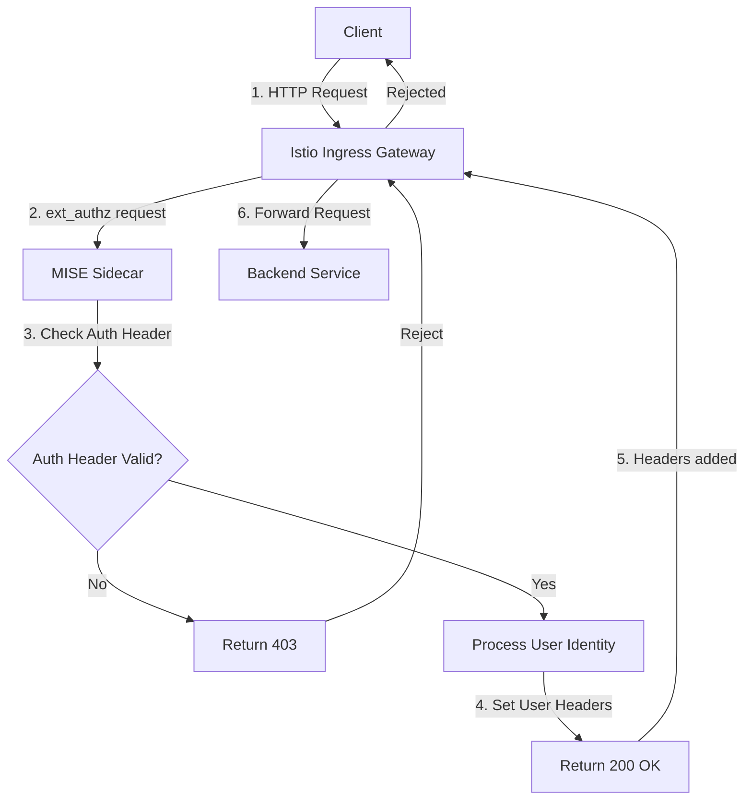
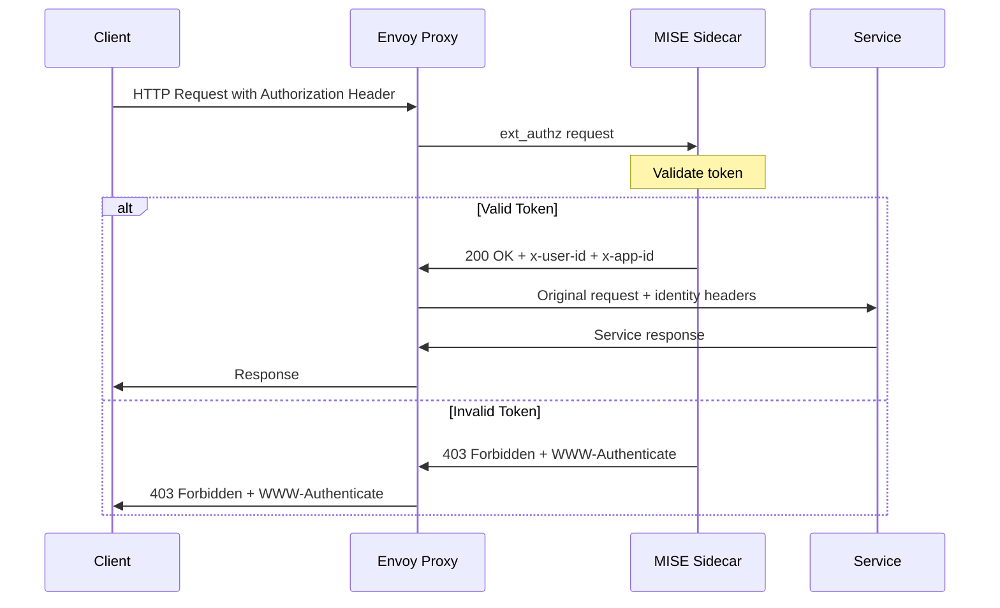

# MISE Integration Flow Diagram

The following diagram illustrates the logical flow of requests through the MISE sidecar:

## Request Flow

1. Client sends a request to an OSDU API endpoint
2. Istio ingress gateway receives the request and routes it to the MISE sidecar
3. MISE sidecar validates the authorization header
4. If the header is valid, MISE identifies the user and sets identity headers
5. Request is forwarded to the backend service with added headers
6. If validation fails, the request is rejected with a 403 error

## Header Flow

