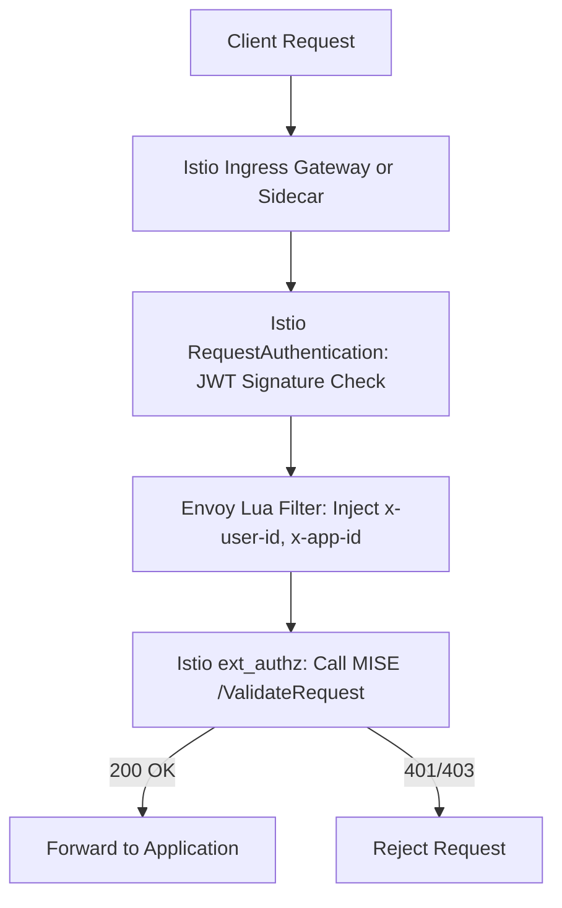

# Microsoft Identity Secure Enclave (MISE) Integration with Istio

This document details how to integrate the Microsoft Identity Secure Enclave (MISE) validation container into the existing Istio-based service mesh to enhance security for OSDU services.

## Overview

This integration adds an additional layer of token validation using the MISE container, working alongside existing Istio JWT signature validation and Lua-based header processing. The integration uses Istio's `CUSTOM` AuthorizationPolicy action and the Envoy external authorization (`ext_authz`) filter to enforce MISE validation.

## Key Components

### Architecture

The MISE validation builds on top of the existing JWT validation flow:

**Current Flow:**


**Enhanced Flow with MISE:**


## Required Istio Version

This integration requires:
- Istio version 1.16.0 or higher
- Istio Service Mesh enabled via `istioServiceMeshEnabled: true` on AKS cluster
- AKS with minimum Istio revision `asm-1-17` (recommended: `asm-1-23`)

## Implementation

### 1. MISE Deployment and Service

Deploy the MISE validation container as a Kubernetes deployment:

```yaml
apiVersion: apps/v1
kind: Deployment
metadata:
  name: mise
  labels:
    app: mise
    app.kubernetes.io/name: mise
spec:
  replicas: {{ .Values.mise.replicas | default 2 }}
  selector:
    matchLabels:
      app: mise
  template:
    metadata:
      labels:
        app: mise
    spec:
      containers:
      - name: mise
        image: {{ .Values.mise.image.repository }}:{{ .Values.mise.image.tag }}
        ports:
        - containerPort: {{ .Values.mise.port | default 5000 }}
        resources:
          requests:
            cpu: {{ .Values.mise.resources.requests.cpu | default "100m" }}
            memory: {{ .Values.mise.resources.requests.memory | default "128Mi" }}
          limits:
            cpu: {{ .Values.mise.resources.limits.cpu | default "200m" }}
            memory: {{ .Values.mise.resources.limits.memory | default "256Mi" }}
---
apiVersion: v1
kind: Service
metadata:
  name: mise
  labels:
    app: mise
spec:
  selector:
    app: mise
  ports:
  - port: {{ .Values.mise.port | default 5000 }}
    targetPort: {{ .Values.mise.port | default 5000 }}
    name: http
```

### 2. Istio MeshConfig Extension Provider

Configure MISE as an external authorization provider using one of two methods:

#### Option A: IstioOperator Configuration (Recommended)

```yaml
apiVersion: install.istio.io/v1alpha1
kind: IstioOperator
spec:
  meshConfig:
    extensionProviders:
    - name: mise
      envoyExtAuthzHttp:
        service: mise.{{ .Release.Namespace }}.svc.cluster.local
        port: {{ .Values.mise.port | default 5000 }}
        includeHeadersInCheck:
          - authorization
          - x-forwarded-for
          - x-user-id
          - x-app-id
        headersToUpstreamOnAllow:
          - x-user-id
          - x-app-id
        statusOnError:
          code: 403
```

#### Option B: EnvoyFilter Configuration (Alternative)

If modifying the mesh configuration isn't possible, create an EnvoyFilter:

```yaml
apiVersion: networking.istio.io/v1alpha3
kind: EnvoyFilter
metadata:
  name: ext-authz
  namespace: {{ .Release.Namespace }}
spec:
  configPatches:
  - applyTo: HTTP_FILTER
    match:
      context: SIDECAR_INBOUND
      listener:
        filterChain:
          filter:
            name: envoy.filters.network.http_connection_manager
            subFilter:
              name: envoy.filters.http.router
    patch:
      operation: INSERT_BEFORE
      value:
        name: envoy.filters.http.ext_authz
        typed_config:
          "@type": "type.googleapis.com/envoy.extensions.filters.http.ext_authz.v3.ExtAuthz"
          transport_api_version: V3
          http_service:
            server_uri:
              uri: http://mise.{{ .Release.Namespace }}.svc.cluster.local:{{ .Values.mise.port | default 5000 }}
              cluster: outbound|{{ .Values.mise.port | default 5000 }}|mise.{{ .Release.Namespace }}.svc.cluster.local
              timeout: 0.5s
            authorization_request:
              allowed_headers:
                patterns:
                - exact: "authorization"
                - exact: "x-forwarded-for" 
                - exact: "x-user-id"
                - exact: "x-app-id"
            authorization_response:
              allowed_upstream_headers:
                patterns:
                - exact: "x-user-id"
                - exact: "x-app-id"
          failure_mode_allow: false
          status_on_error:
            code: 403
```

### 3. AuthorizationPolicy with CUSTOM Action

Apply an AuthorizationPolicy to enforce MISE validation:

```yaml
apiVersion: security.istio.io/v1beta1
kind: AuthorizationPolicy
metadata:
  name: require-mise-validation
  namespace: {{ .Release.Namespace }}
spec:
  selector:
    matchLabels:
      app.kubernetes.io/name: {{ include "osdu-developer-base.name" . }}
  action: CUSTOM
  provider:
    name: mise
  rules:
    - to:
        - operation:
            methods: ["GET", "POST", "PUT", "DELETE", "PATCH"]
```

## Configuration

Update the values.yaml file with MISE configuration options:

```yaml
# MISE Configuration
mise:
  enabled: false  # Set to true to enable MISE validation
  image:
    repository: your-registry/mise
    tag: latest
  port: 5000
  replicas: 2
  resources:
    requests:
      cpu: "100m"
      memory: "128Mi"
    limits:
      cpu: "200m"
      memory: "256Mi"
```

## Usage

To enable MISE validation:

1. Set `mise.enabled: true` in your values.yaml file
2. Ensure IstioOperator configuration includes the MISE extensionProvider
3. Deploy the chart with:
```bash
helm upgrade --install osdu-base ./osdu-developer-base -n your-namespace -f values.yaml
```

## Testing and Verification

1. Apply the updated Helm chart
2. Send a request with a valid JWT to your application service
3. Verify that:
   - MISE receives a request at `/ValidateRequest`
   - Request only proceeds if MISE returns 200 OK
   - Otherwise, a 401 or 403 error is returned

## Troubleshooting

### Increasing Logging Level

To debug MISE validation issues, you can increase the logging levels:

```bash
# Increase ext_authz logging
istioctl proxy-config log <pod_name> --level ext_authz:debug
```

### Checking MISE Logs

```bash
kubectl logs -l app=mise -n <namespace>
```

## Benefits

- Enhanced security through double validation (JWT signature + MISE policy)
- Separation of concerns (Istio handles basic JWT validation, MISE handles advanced policies)
- Easily configurable and can be disabled if needed